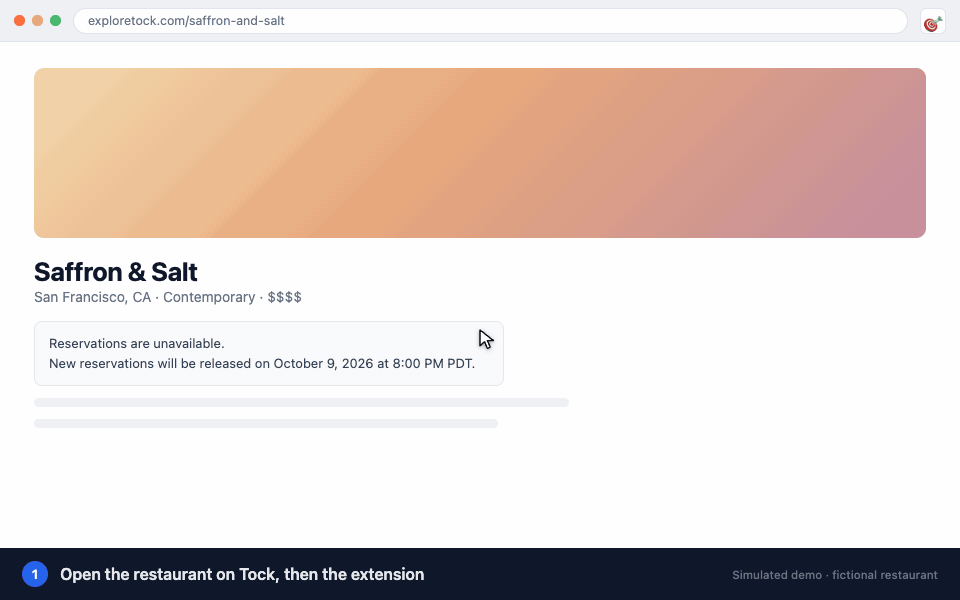

#  Tock Sniper

Auto-grab reservations on [Tock](https://www.exploretock.com) the instant they drop.

> **Unofficial.** Tock Sniper is an independent open-source project. It is not affiliated with, endorsed by,
> or sponsored by Tock, Resy, or American Express. "Tock" is used only to describe the site this extension
> works with.

[Chrome Web Store](https://chromewebstore.google.com/detail/tock-sniper/ppgobdppcdhckikdbajbhlmohfmhpioo) · [Releases](../../releases)

Simulated with a fictional restaurant — the popup and overlay are the extension's real UI
(`scripts/demo.html`, recorded with `node scripts/record-demo.mjs`).

## Quick start

1. Open the restaurant's Tock page, click the extension icon, then **Use this page** — it fills in the restaurant
   and offers the experience and release time it finds (one click each)
2. Set party size, add the dates and times you want (in order of preference), and click **Arm Sniper**
3. At release it grabs a slot and opens checkout — **you complete payment** ✅

Everything else has sensible defaults, and each option has a one-line hint in the popup.

## Features

- **⚡ API mode** — locks the slot with Tock's own request at the release instant, no page reload
- **🖱️ DOM mode** — reloads just before release and clicks through the booking dialog
- **Priorities** — dates and times are tried in the order you add them
- **Monitor** *(optional)* — keeps watching after release and grabs seats that open later, or the closest time nearby
- **Partial parties** *(optional)* — if only single seats are sold, book as many as offered
- **Telegram alerts** *(optional)* — when seats appear or a slot is locked
- **Rate-limit aware** — one tab for all API targets, stops at the first 429, and after release only sends a lock when the calendar shows a table
- **Activity log** — exportable from the popup

## Install

### From Chrome Web Store
[Tock Sniper on the Chrome Web Store](https://chromewebstore.google.com/detail/tock-sniper/ppgobdppcdhckikdbajbhlmohfmhpioo) — easiest, updates automatically.

The store version can lag behind: every new version waits for Google's review (usually a few days), so new
features reach [GitHub releases](https://github.com/jiaton/tock-sniper-chrome-extension/releases/latest) first. Current status (updated automatically):

<!-- store-diff:start -->
⏳ **Chrome Web Store: v3.1.0 · latest release: v3.2.0** (v3.2.0 in review)

Not in the store version yet (11 changes)

- Monitor: read seat availability, take a nearby open time; keep an activity log
- Monitor: a listed experience isn't availability; show party-size limits
- Pre-check single lock attempts against offerings + calendar
- Monitor: don't repeat the pre-check's requests right away
- API mode: one tab for all targets, tried by priority
- Only one API tab sends: lease from the background
- Party-size policy: optionally lock as many seats as offered
- Burst: weight sends by target priority
- Fix monitor crash after editing the popup while armed
- Store status: full checkout so the README commit can rebase
- Release v3.2.0: one API tab for all targets, seat-aware monitor, partial parties

[Full comparison](https://github.com/jiaton/tock-sniper-chrome-extension/compare/v3.1.0...v3.2.0) · get v3.2.0 now: [manual install](#manual--developer)

<!-- store-diff:end -->

### Manual / Developer
1. Download `tock-sniper-ext.zip` from the [latest release](../../releases/latest) and unzip it (or clone this repo for unreleased changes on `main`)
2. Go to `chrome://extensions`
3. Enable "Developer mode"
4. Click "Load unpacked" → select the unzipped (or cloned) folder

After updating, click the reload icon on the extension card and reload any open Tock tabs.

## Telegram setup
Create a bot with [@BotFather](https://t.me/BotFather), get your chat ID (e.g. from [@userinfobot](https://t.me/userinfobot)),
enter both under **Monitor & notifications**, and click **Send test**. Chrome asks once for permission to reach
`api.telegram.org` — it's optional and only requested when you switch Telegram on. The token is stored only in
your browser.

## Good to know

- Most Tock restaurants release on a schedule and say when on their page ("New reservations will be released on …").
  Some release at random to their Notify waitlist instead — no tool can race those.
- A listed experience isn't availability: sold-out restaurants keep listing theirs.

## Use responsibly

- **Check Tock's Terms of Service** before using this. Automated booking may be against them, and Tock can
  rate-limit or restrict accounts — lock requests were observed to stay rate-limited for ~30 minutes after a burst.
- It books only for you, with your own logged-in session, and **never pays** — you complete checkout yourself.
  Don't use it to resell reservations.
- It talks to Tock's private web API, which can change at any time and break things without notice.
- **Use at your own risk.** No warranty — see the license.

## Privacy

No analytics, no developer server. Settings (including an optional Telegram bot token) live in
`chrome.storage.local` in your browser. The extension talks only to exploretock.com (your own session) and,
if you enable it, api.telegram.org (your own bot).

## License

[MIT](LICENSE)
